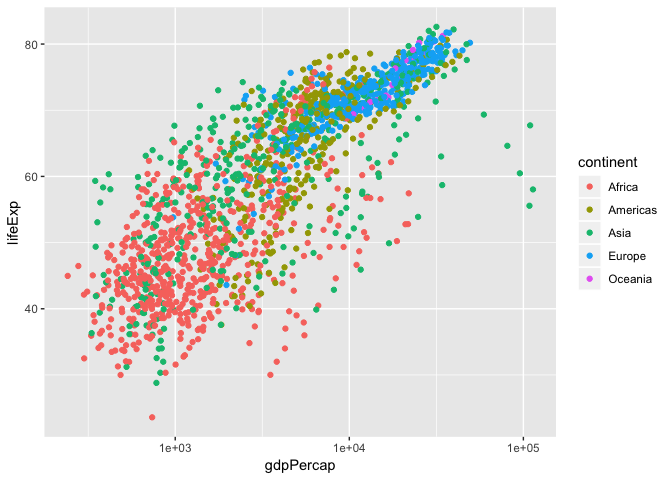
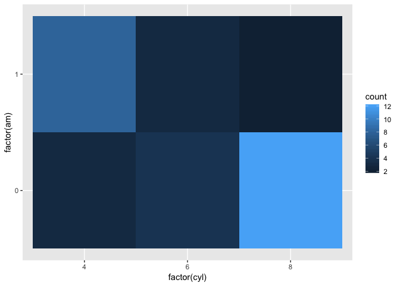
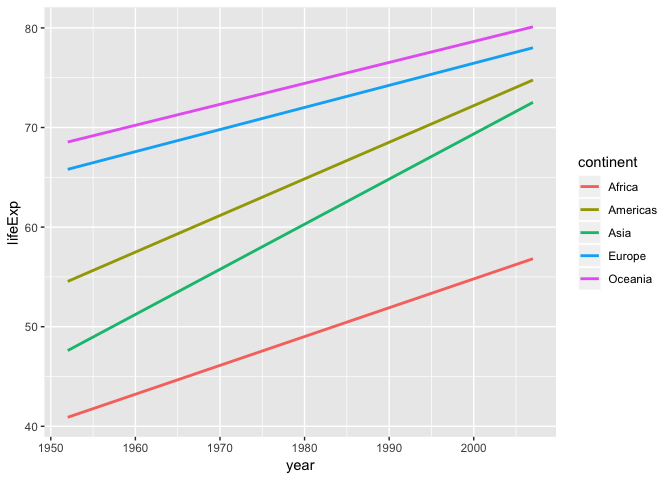

---
title: "cm007 Exercises: Exploring Aesthetic Mappings"
output: html_notebook
editor_options: 
  chunk_output_type: inline
---


```r
library(tidyverse)
```

```
## ── Attaching packages ────────────────────────────────── tidyverse 1.2.1 ──
```

```
## ✔ ggplot2 3.0.0     ✔ purrr   0.2.5
## ✔ tibble  1.4.2     ✔ dplyr   0.7.6
## ✔ tidyr   0.8.1     ✔ stringr 1.2.0
## ✔ readr   1.1.1     ✔ forcats 0.3.0
```

```
## ── Conflicts ───────────────────────────────────── tidyverse_conflicts() ──
## ✖ dplyr::filter() masks stats::filter()
## ✖ dplyr::lag()    masks stats::lag()
```

```r
library(gapminder)
```


# Beyond the x and y aesthetics

Switch focus to exploring aesthetic mappings, instead of geoms. 

## Shapes

- Try a scatterplot of `gdpPercap` vs `lifeExp` with a categorical variable (continent) as `shape`.


```r
gvsl <- ggplot(gapminder, aes(gdpPercap, lifeExp)) +
  scale_x_log10() 
gvsl+ geom_point(aes(shape=continent), alpha =0.2)
```

<!-- -->

- As with all (?) aesthetics, we can also have them _not_ as aesthetics!
    - Try some shapes: first as integer from 0-24, then as keyboard characters.
    - What's up with `pch`? 
    #PCH is a base r way of inidicating shape


```r
gvsl + geom_point(shape = 7)
```

<!-- -->

```r
gvsl + geom_point(pch = 7)
```

<!-- -->

```r
gvsl + geom_point(shape = "%")
```

<!-- -->

List of shapes can be found [at the bottom of the `scale_shape` documentation](https://ggplot2.tidyverse.org/reference/scale_shape.html).

## Colour

Make a scatterplot. Then:

- Try colour as categorical variable.


```r
gvsl + geom_point(aes(color = continent))
```

<!-- -->

```r
gvsl + geom_point(aes(color =pop))
```

<!-- -->


- Try `colour` and `color`. 
- Try colour as numeric variable.
    - Try `trans="log10"` for log scale.
    
##log scales brings everything down to a cluster instead of having lots of far away rogue/outlier values

```r
gvsl + geom_point(aes(color =pop)) + scale_color_continuous(trans="log10")
```

<!-- -->

```r
gvsl + geom_point(aes(color = lifeExp > 60))
```

<!-- -->


Make a line plot of `gdpPercap` over time for all countries. Colour by `lifeExp > 60` (remember that `lifeExp` looks bimodal?)


Try adding colour to a histogram. How is this different?


```r
ggplot(gapminder, aes(lifeExp)) + 
  geom_histogram(aes(color=continent))
```

```
## `stat_bin()` using `bins = 30`. Pick better value with `binwidth`.
```

<!-- -->

```r
ggplot(gapminder, aes(lifeExp)) + 
  geom_histogram(aes(fill=continent))
```

```
## `stat_bin()` using `bins = 30`. Pick better value with `binwidth`.
```

<!-- -->
Above is an example of overplotting - too much info on one plot. not apparent if all bins go to the bottom

## Facetting
This fixes the problem of overplotting above
Make histograms of `gdpPercap` for each continent. Try the `scales` and `ncol` arguments. 


```r
ggplot(gapminder, aes(lifeExp)) +
  facet_wrap( ~ continent) +
  geom_histogram()
```

```
## `stat_bin()` using `bins = 30`. Pick better value with `binwidth`.
```

<!-- -->

```r
ggplot(gapminder, aes(lifeExp)) +
  facet_wrap( ~ continent, scale = 'free_x') +
  geom_histogram()
```

```
## `stat_bin()` using `bins = 30`. Pick better value with `binwidth`.
```

<!-- -->

```r
#free_x to allow individual scales for each subplot
```


Remove Oceania. Add another variable: `lifeExp > 60`. 


```r
ggplot(gapminder, aes(gdpPercap)) + 
  facet_grid(continent ~ lifeExp > 60) +
  geom_histogram()
```

```
## `stat_bin()` using `bins = 30`. Pick better value with `binwidth`.
```

<!-- -->

```r
#the true/false is life > 60 or not
```


## Bubble Plots


- Add a `size` aesthetic to a scatterplot. What about `cex`?


```r
gvsl + geom_point(aes(size = pop), alpha = 0.2)
```

<!-- -->


```r
gvsl + geom_point(aes(size = pop), alpha = 0.2) +
  scale_size_area()
```

<!-- -->


- Try adding `scale_radius()` and `scale_size_area()`. What's better?


```r
gvsl + geom_point(aes(size = pop, fill = continent), shape = 21, color = "black", alpha = 0.3)
```

<!-- -->

```r
#notice it is not in the aes mapping
```

- Use `shape=21` to distinguish between `fill` (interior) and `colour` (exterior).


## "Complete" plot

Let's try plotting much of the data.

- gdpPercap vs lifeExp with pop bubbles
- facet by year
- colour by continent


```r
gvsl + geom_point(aes(size=pop, color=continent)) +
  scale_size_area() +
  facet_wrap(~ year)
```

<!-- -->


# Continue from last time (geom exploration with `x` and `y` aesthetics)

## Path plots

Let's see how Rwanda's life expectancy and GDP per capita have evolved over time, using a path plot.

- Try `geom_line()`. Try `geom_point()`.


```r
gapminder %>% 
  filter(country == "Rwanda") %>% 
  ggplot(aes(gdpPercap, lifeExp)) +
  scale_x_log10() + 
  geom_point()
```

<!-- -->

```r
gapminder %>% 
  filter(country == "Rwanda") %>% 
  arrange(year) %>% 
  ggplot(aes(gdpPercap, lifeExp)) +
  scale_x_log10() + 
  geom_point() +
  geom_path() +
  geom_path(arrow=arrow())
```

<!-- -->

```r
gapminder %>% 
  filter(country == "Rwanda") %>% 
  ggplot(aes(gdpPercap, lifeExp)) +
  scale_x_log10() + 
  geom_point() +
  geom_line()
```

<!-- -->

- Add `arrow=arrow()` option.


- Add `geom_text`, with year label. 


## Two categorical variables

Try `cyl` (number of cylinders) ~ `am` (transmission) in the `mtcars` data frame.


```r
ggplot(mtcars, aes(cyl, am)) +
  geom_point()
```

<!-- -->

- Scatterplot? Jitterplot? No.


```r
ggplot(mtcars, aes(cyl, am)) +
  geom_jitter()
```

<!-- -->

- `geom_count()`.

```r
ggplot(mtcars, aes(cyl, am)) +
  geom_count()
```

<!-- -->

- `geom_bin2d()`. Compare with `geom_tile()` with `fill` aes.

```r
ggplot(mtcars, aes(factor(cyl), factor(am))) +
  geom_bin2d()
```

<!-- -->

```r
ggplot(mtcars, aes(factor(cyl), factor(am))) +
  geom_tile()
```

<!-- -->


## Overplotting

Try a scatterplot with:

- Alpha transparency.
- `geom_hex()`
- `geom_density2d()`
- `geom_smooth()`


```r
library(hexbin)
gvsl + geom_hex()
```

<!-- -->

```r
gvsl + geom_smooth(alpha =0.2)
```

```
## `geom_smooth()` using method = 'gam' and formula 'y ~ s(x, bs = "cs")'
```

<!-- -->

```r
gvsl + geom_point(alpha = 0.2) + geom_smooth(method = 'lm')
```

<!-- -->


## Bar plots

How many countries are in each continent? Use the year 2007.

1. After filtering the gapminder data to 2007, make a bar chart of the number of countries in each continent. Store everything except the geom in the variable `d`.


```r
gapminder %>% 
  filter(year == 2007) %>% 
  ggplot(aes(x = continent)) +
  geom_bar()
```

<!-- -->


```r
gapminder %>% 
  filter(year == 2007) %>% 
  ggplot(aes(x = continent)) +
  geom_bar()
```

<!-- -->

```r
  geom_col()
```

```
## geom_col: width = NULL, na.rm = FALSE
## stat_identity: na.rm = FALSE
## position_stack
```

2. Notice the y-axis. Oddly, `ggplot2` doesn't make it obvious how to change to proportion. Try adding a `y` aesthetic: `y=..count../sum(..count..)`.


__Uses of bar plots__: Get a sense of relative quantities of categories, or see the probability mass function of a categorical random variable.


## Polar coordinates

- Add `coord_polar()` to a scatterplot.

```r
gvsl + geom_point() + coord_polar()
```

<!-- -->


# Want more practice?

If you'd like some practice, give these exercises a try

__Exercise 1__: Make a plot of `year` (x) vs `lifeExp` (y), with points coloured by continent. Then, to that same plot, fit a straight regression line to each continent, without the error bars. If you can, try piping the data frame into the `ggplot` function.


```r
ggplot(gapminder, aes(year, lifeExp)) + 
  geom_point(aes(color=continent)) + 
  geom_smooth(aes(line=continent))
```

```
## Warning: Ignoring unknown aesthetics: line
```

```
## `geom_smooth()` using method = 'loess' and formula 'y ~ x'
```

<!-- -->


```r
ggplot(gapminder, aes(year, lifeExp, group = continent)) + 
  geom_point(aes(color=continent)) + 
  geom_smooth(method = 'lm', se = TRUE)
```

<!-- -->

```r
#wavy grey part is a confidence interval, se=TRUE
```

```r
ggplot(gapminder, aes(year, lifeExp, color = continent)) + 
  geom_point(aes(color=continent)) + 
  geom_smooth(method = 'lm', se = FALSE)
```

<!-- -->

__Exercise 2__: Repeat Exercise 1, but switch the _regression line_ and _geom\_point_ layers. How is this plot different from that of Exercise 1?


```r
ggplot(gapminder, aes(year, lifeExp, color = continent)) + 
  geom_smooth(method = 'lm', se = FALSE) +
  geom_point(aes(color=continent)) 
```

<!-- -->


__Exercise 3__: Omit the `geom_point` layer from either of the above two plots (it doesn't matter which). Does the line still show up, even though the data aren't shown? Why or why not?

```r
ggplot(gapminder, aes(year, lifeExp, color = continent)) + 
  geom_smooth(method = 'lm', se = FALSE)
```

<!-- -->


__Exercise 4__: Make a plot of `year` (x) vs `lifeExp` (y), facetted by continent. Then, fit a smoother through the data for each continent, without the error bars. Choose a span that you feel is appropriate.


```r
ggplot(gapminder, aes(year, lifeExp, color = continent)) +
       facet_wrap(~continent) +
       geom_smooth(method = 'lm', se = FALSE) +
         geom_point()
```

<!-- -->


__Exercise 5__: Plot the population over time (year) using lines, so that each country has its own line. Colour by `gdpPercap`. Add alpha transparency to your liking. 


__Exercise 6__: Add points to the plot in Exercise 5.
